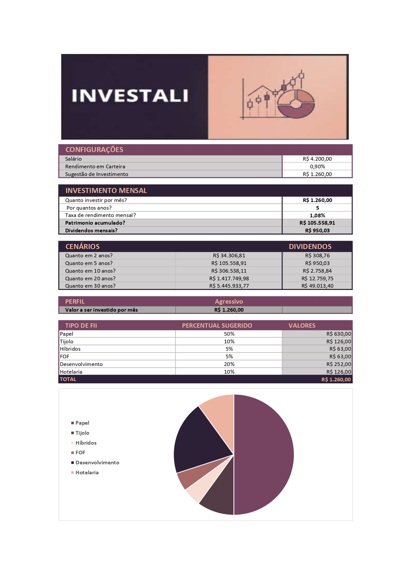

# Investali - Simulador de Investimentos em FIIs

## 📝 Descrição do Projeto
Este projeto foi desenvolvido como parte de um desafio prático da **DIO (Digital Innovation One)**. O objetivo é aplicar conceitos de Excel para criar uma ferramenta de simulação de investimentos em Fundos Imobiliários (FIIs), auxiliando na tomada de decisão baseada em dados financeiros.

A planilha automatiza cálculos complexos como:
- Patrimônio acumulado ao longo do tempo.
- Estimativa de dividendos mensais.
- Projeção de cenários (de 2 a 30 anos).
- Sugestão de alocação por perfil de investidor.

## 📊 Funcionalidades
- **Configurações Personalizadas:** Entrada de salário e taxa de rendimento.
- **Simulador Mensal:** Cálculo automático de quanto investir para atingir metas.
- **Análise de Cenários:** Visualização rápida do crescimento do patrimônio em diferentes prazos.
- **Divisão por Tipo de FII:** Sugestão percentual entre Papel, Tijolo, Híbridos, entre outros.
- **Dashboard Visual:** Gráfico de pizza para visualização da distribuição da carteira.

## 🛠️ Tecnologias Utilizadas
- **Microsoft Excel:** Fórmulas financeiras, formatação condicional e gráficos.
- **Markdown:** Para documentação técnica no GitHub.

## 📸 Screenshots

## 🚀 Como usar
1. Faça o download do arquivo `.xlsx` presente neste repositório ou acesse o link [AQUI](https://1drv.ms/x/c/df16429a6e22e038/IQAK0DR9SDJ2RZqyOdr7H7j5ATL4HnALpF0S8VNvAjxoo_o?e=TlDgEY)
2. Abra no Microsoft Excel ou Google Sheets.
3. Insira seus dados nos campos de "Configurações" e "Investimento Mensal" para ver as projeções.
